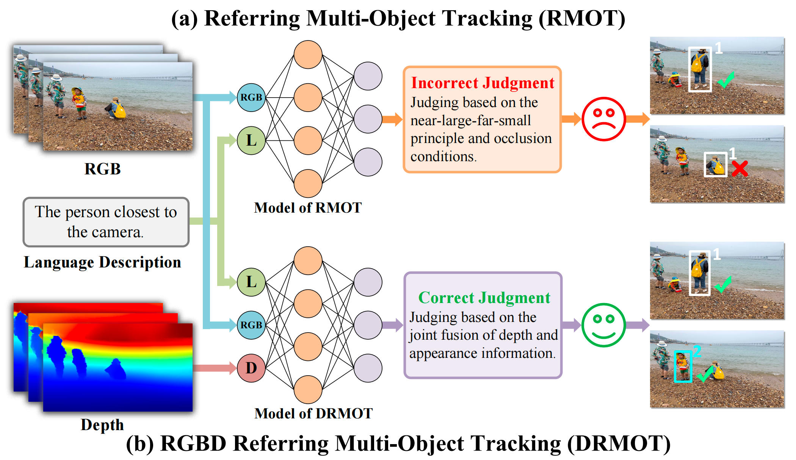

# 🚀 DRMOT: A Dataset and Framework for RGBD Referring Multi-Object Tracking

> [**DRMOT: A Dataset and Framework for RGBD Referring Multi-Object Tracking**](https://arxiv.org/pdf/2602.04692)              
> Sijia Chen *, Lijuan Ma *, Yanqiu Yu *, En Yu, Liman Liu, Wenbing Tao   
> Huazhong University of Science and Technology; South-Central Minzu University                        
> *[ArXiv] Paper ([https://arxiv.org/pdf/2602.04692](https://arxiv.org/pdf/2602.04692))*

**Note:** 

If our paper is accepted, we will fully open-source our **DRSet dataset** and **DRTrack framework** (including its code and model weights) **within one month**, **just like our [**CRMOT**](https://github.com/chen-si-jia/CRMOT) project**.

Thanks for your attention! If you are interested in our work, please give us a star ⭐️.

## 🔍 DRMOT vs RMOT

**Comparison between RMOT and DRMOT.** 

(a) **RMOT Failure:** RMOT model relying solely on RGB images and language (L) is unable to correctly ground the referring expression under depth-dependent spatial descriptions. Although candidate objects are detected, the absence of explicit depth cues leads to ambiguous spatial reasoning and incorrect target grounding selection. 

(b) **DRMOT Success:** By integrating RGB, language (L), and depth (D) information, the DRMOT model leverages depth cues to resolve spatial ambiguity, thereby achieving accurate target grounding and maintaining temporal identity consistency. This comparison demonstrates the necessity of depth information for disambiguating depth-related referring descriptions that are indistinguishable in the 2D image space.

